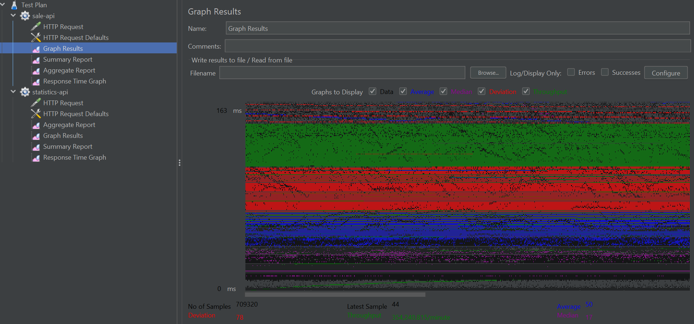
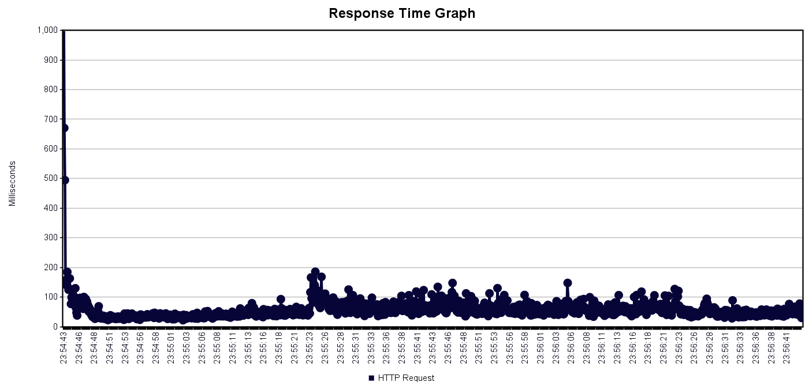
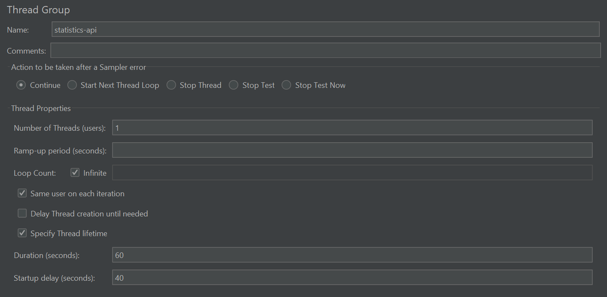
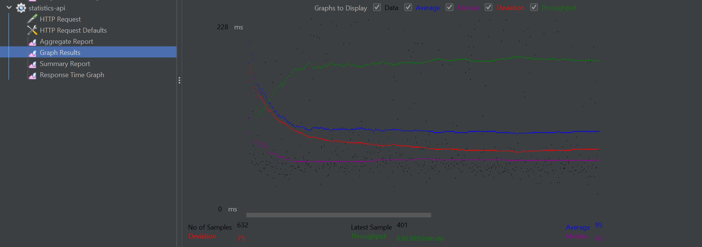
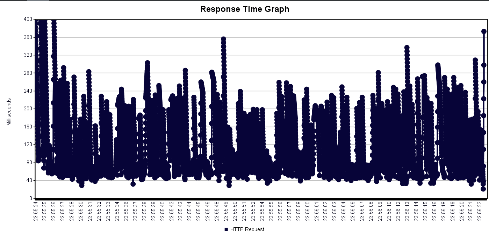

# eClassifieds Group (eCG), Coding challege

## Goal
To build a system that can perform sale transactions.

## Considerations
- Performance (Time complexity, Load Test),
- Optimizing Memory Usage

## Development Tools
- Java 11
- Spring Boot

## Testing Tools
- JUnit
- JMeter (Performance Test)

## About Performance Test
To test the server's performance, I used JMeter.

**Sample Test Plan setup**

Sale-API

- Graph Result

- Response  Graph

Statistics-API

- Graph Result
  

- Response  Graph
  
