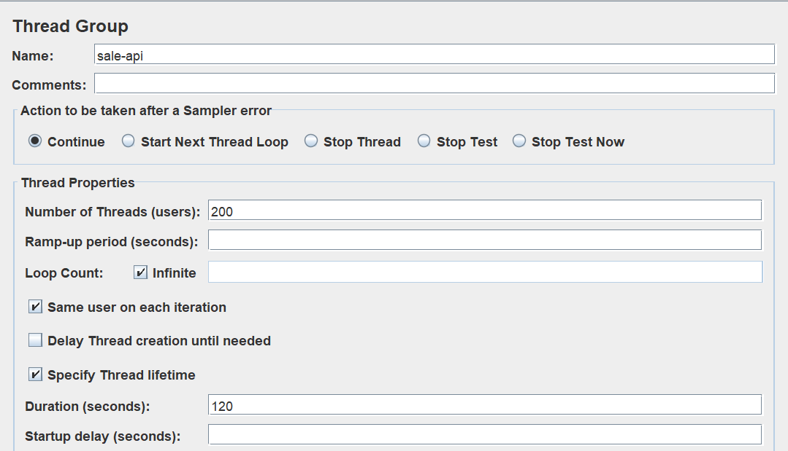
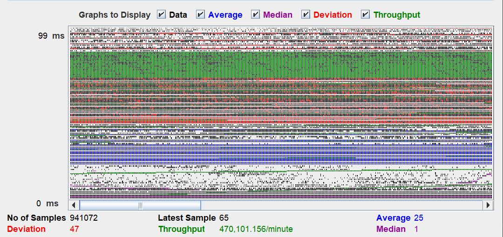
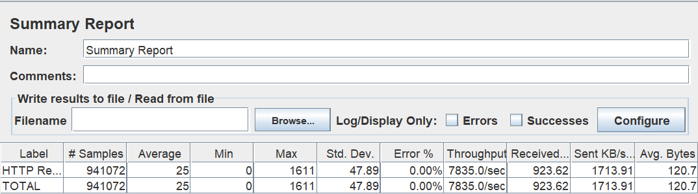
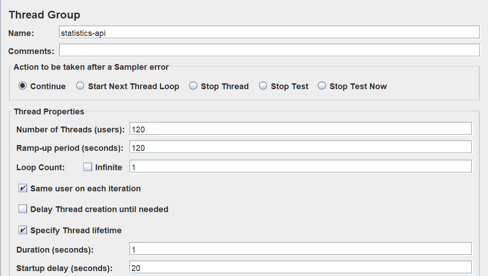
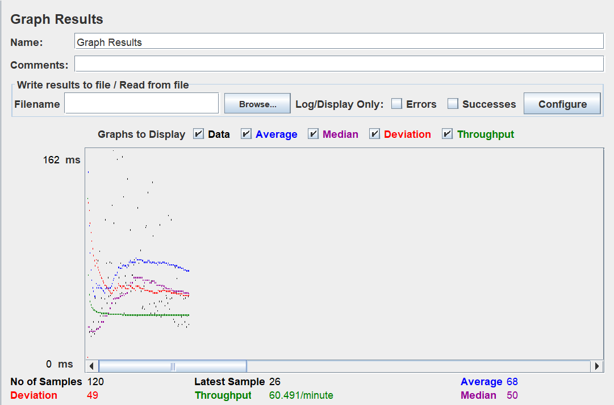
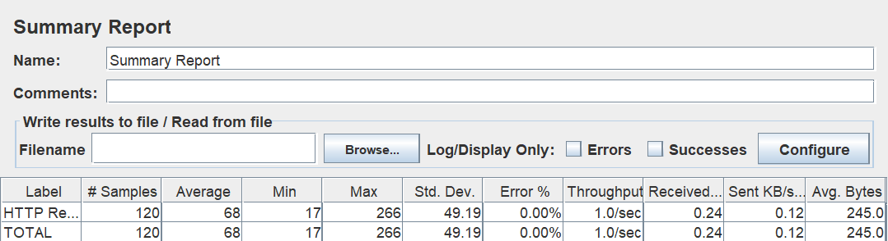

# eClassifieds Group (eCG), Coding challege

## Goal
To build a system that can perform sale transactions.

## Considerations
- Performance (Time complexity, Load Test),
- Optimizing Memory Usage

## Development Tools
- Maven
- Java 11
- Spring Boot

## Testing Tools
- JUnit
- JMeter (Performance Test)

## Setup
- To build and run the project: `mvn clean spring-boot:run`
- To verify performance test: `mvn clean verify`

## About Performance Test
To test the server's performance, I used JMeter GUI.

**Sample Test Plan setup**

I created two thread groups: one for sale api and another for statistics api. 

*Sale-API*

- Graph Result

- Summary Report

*Statistics-API*

- Graph Result
  

- Summary Report
  
